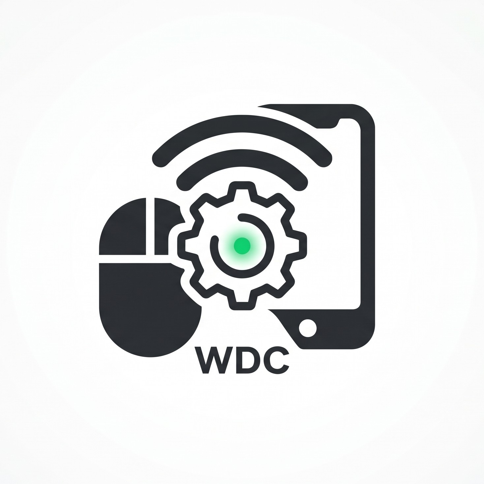
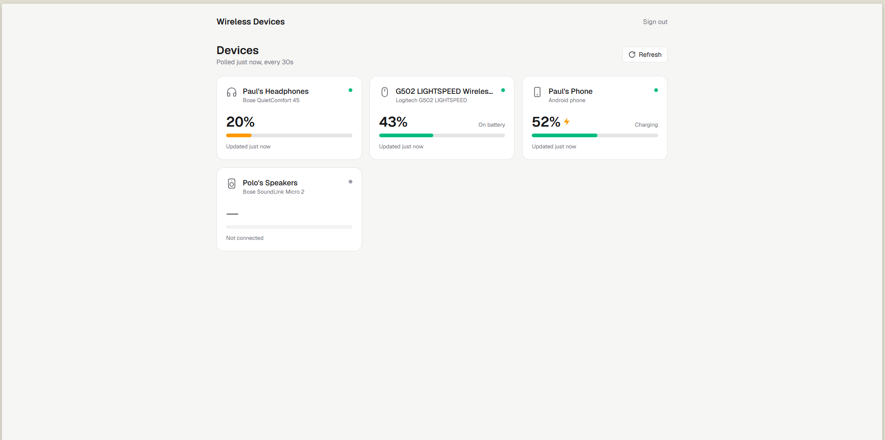
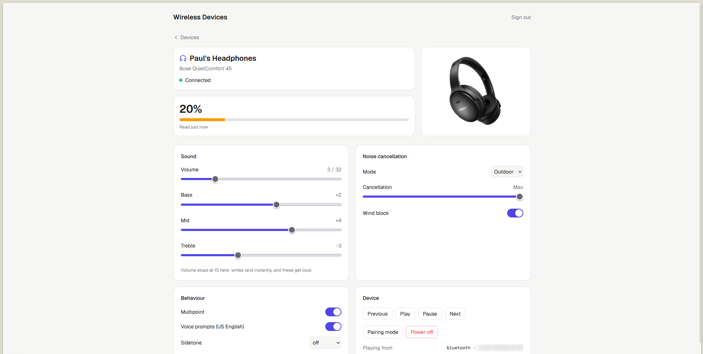
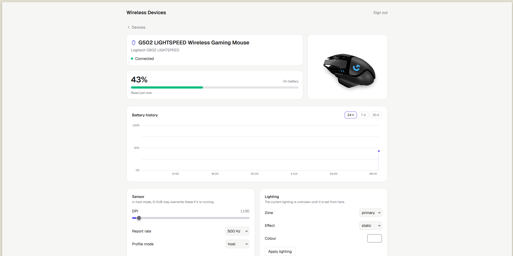
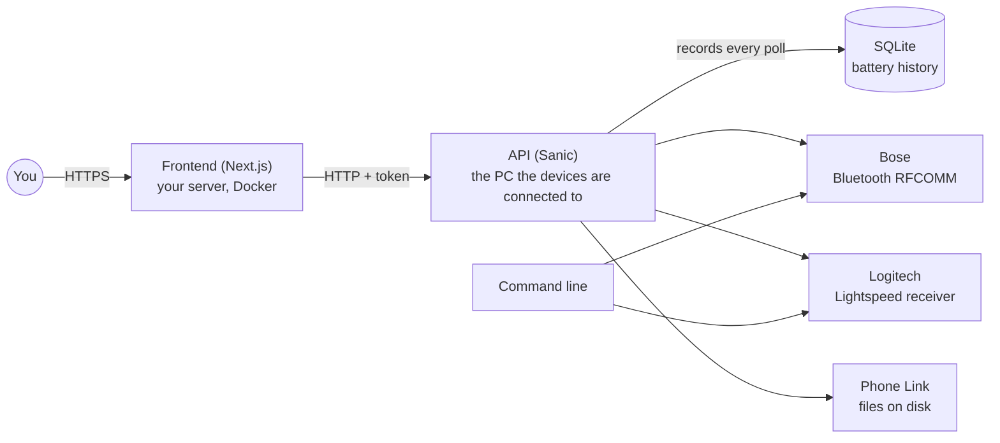

<div align="center">

  

  # Wireless Devices Control

  **Control my wireless devices and keep an eye on their batteries, without any vendor app, cloud or account.**

  [](#️--disclaimer)
  [](LICENSE)
  [](https://nextjs.org)
  [](https://www.python.org)
  [](https://sanic.dev)
  [](https://www.sqlite.org)

  
</div>


## ⚠️ • Disclaimer

Every protocol here was **reverse engineered** and is spoken directly to the hardware: BMAP over Bluetooth RFCOMM for Bose, HID++ 2.0 through the Lightspeed receiver for Logitech. Nothing breaks encryption or replays traffic, but writes land on a real device instantly, so use it at your own risk. This is also a personal project built around the devices on my desk, not a polished product: expect missing pieces, sharp edges, and breaking changes.


## 📋 • Table of Contents

- [📖 • Overview](#--overview)
- [🖼️ • Screenshots](#️--screenshots)
- [🎧 • Supported Devices](#--supported-devices)
- [🧩 • Components](#--components)
- [🛠️ • Tech Stack](#️--tech-stack)
- [🚀 • Getting Started](#--getting-started)
  - [Prerequisites](#prerequisites)
  - [Installation](#installation)
  - [Environment Variables](#environment-variables)
  - [Running Locally](#running-locally)
- [🔌 • API](#--api)
- [🔋 • Battery History](#--battery-history)
- [⌨️ • Command Line](#️--command-line)
- [📁 • Project Structure](#--project-structure)
- [🐳 • Docker Deployment](#--docker-deployment)
- [➕ • Adding a Device](#--adding-a-device)
- [📡 • Notes on the Protocols](#--notes-on-the-protocols)
- [🤝 • Contributing](#--contributing)
- [🙌 • Credits](#--credits)
- [📄 • License](#--license)


## 📖 • Overview

Wireless Devices Control replaces the Bose Music app and Logitech G HUB for the things I actually use them for: seeing how much battery is left, and changing a setting now and then. It talks to each device in its own protocol from the PC it is connected to, and puts everything behind one small web dashboard.

Key features:
- Battery of every device on one page, polled in the background, lowest first
- Battery history per device, with the charging phases, kept across restarts
- Bose settings: volume, EQ, noise cancellation modes, wind block, multipoint, voice prompts, sidetone, standby timer, name
- Bose actions: play, pause, next, previous, pairing mode, power off
- Logitech settings: DPI, report rate, lighting per zone, host or onboard profile mode
- A linked Android phone's battery, read from what Phone Link already fetched
- A documented HTTP API (OpenAPI, Scalar) behind a single token
- A command line for every protocol, for debugging and for mapping a new device

```console
$ uv run __main__.py
  Paul's Speakers                        micro2    not connected
  Paul's Headphones                      qc45      70%
  G502 LIGHTSPEED Wireless Gaming Mouse  g502      49% (discharging, 3807 mV)
```


## 🖼️ • Screenshots

| Headphones | Mouse |
|---|---|
|  |  |


## 🎧 • Supported Devices

| Device | Vendor | Key | Link | Status |
|---|---|---|---|---|
| QuietComfort 45 headphones | Bose | `qc45` | Bluetooth, RFCOMM channel 8 | Reads, volume and transport controls verified, plus a ModeConfig write |
| SoundLink Micro 2 speaker | Bose | `micro2` | Bluetooth, RFCOMM channel 1 | Reads, volume, power off and pairing verified; mapped from scratch |
| G502 LIGHTSPEED mouse | Logitech | `g502` | Lightspeed receiver `046D:C539` | Battery, DPI, report rate, LEDs, onboard mode |
| Android phone | Phone Link | `phone` | Phone Link's files on Windows | Battery and charging state, read-only |


## 🧩 • Components

Three pieces, one device layer:



| Component | Description |
|---|---|
| [`src/api`](src/api) | Owns the hardware: it polls every battery in the background, keeps the last reading of each device in memory and the history of them on disk, and exposes settings and actions. It runs natively on the machine the devices are connected to, since Docker cannot reach a Bluetooth radio. |
| [`src/frontend`](src/frontend) | A Next.js app with a login. It calls the API from its server, so the token never reaches the browser. |
| [`src/cli`](src/cli) | The debugging tool for the device layer ([`src/devices`](src/devices)) that the API shares. |


## 🛠️ • Tech Stack

| Layer | Technology |
|---|---|
| Frontend | [Next.js 16](https://nextjs.org) (App Router, React 19), TypeScript 5 |
| Styling / UI | Tailwind CSS v4, hand-written components |
| Charts | Hand-drawn SVG, no chart library |
| 3D device views | [`<model-viewer>`](https://modelviewer.dev) + [three.js](https://threejs.org) |
| Auth | The API token, and a signed session cookie on the frontend |
| API | Python 3.14, [Sanic](https://sanic.dev) + sanic-ext (OpenAPI, Scalar), managed with [uv](https://docs.astral.sh/uv/) |
| Bose | BMAP over Bluetooth RFCOMM, standard library only |
| Logitech | HID++ 2.0 through [hidapi](https://github.com/trezor/cython-hidapi) |
| Database | SQLite (standard library), for the battery history only |
| Containerization | Docker, for the frontend |


## 🚀 • Getting Started

### Prerequisites

- [`uv`](https://docs.astral.sh/uv/), which supplies Python 3.14 (API and command line)
- [Node.js](https://nodejs.org) ≥ 20 and npm (frontend), or Docker to run the published image
- **Bose:** the device paired **and connected** in Settings → Bluetooth & devices (Linux: through `bluetoothctl`). BMAP rides the same link as audio, so a device that is merely paired cannot be reached; if it is attached to your phone, disconnect it there first. macOS is not supported.
- **Logitech:** the receiver plugged in and the mouse awake. In host mode G HUB may overwrite DPI and LED changes; quit it, or switch to `logitech mode onboard`, if settings don't stick.
- **Phone Link:** Windows, with Phone Link running and a phone linked.

### Installation

```bash
# 1. Clone the repository
git clone https://github.com/PaulBayfield/.wireless-devices-control.git
cd .wireless-devices-control

# 2. Install the API's and the command line's dependencies
uv sync

# 3. Install the frontend's dependencies
cd src/frontend && npm install && cd ../..
```

The project runs from its own tree rather than being built into a wheel.

### Environment Variables

Two independent scopes, each with its own `.env.example` to copy from.

**1. [`.env.example`](.env.example) → `.env`** at the repo root, read by the API:

| Variable | Required | Description |
|---|---|---|
| `API_TOKEN` | **Yes** | The single token every route requires, 32+ characters. Run `uv run python -c "import secrets; print(secrets.token_urlsafe(32))"` |
| `API_HOST` | No (default `127.0.0.1`) | Address to listen on. Use `0.0.0.0` or a VPN address for the frontend server to reach it |
| `API_PORT` | No (default `7000`) | Port to listen on |
| `API_DOMAIN` | No (default `http://localhost:7000`) | Public URL shown in the OpenAPI documentation |
| `API_DEBUG` | No (default `False`) | Sanic debug mode |
| `POLL_INTERVAL` | No (default `30`) | Seconds between two battery polls |
| `HISTORY_PATH` | No (default `data/battery.db`) | The SQLite file the battery history is kept in |
| `HISTORY_DAYS` | No (default `90`) | How many days of battery history are kept |

**2. [`src/frontend/.env.example`](src/frontend/.env.example) → `src/frontend/.env.local`**:

| Variable | Required | Description |
|---|---|---|
| `API_URL` | **Yes** | The device API, on the machine the devices are connected to (LAN or VPN address) |
| `API_TOKEN` | **Yes** | The same token as the API's. Also what you type on the login page |

### Running Locally

```bash
# 1. Run the API, on the machine the devices are connected to
uv run __main__.py serve

# 2. Run the frontend
cd src/frontend
npm run dev
```

The frontend is available at [http://localhost:3000](http://localhost:3000) and the API documentation at [http://localhost:7000](http://localhost:7000). The login page asks for the API token.


## 🔌 • API

Documentation (Scalar) is at `/`, the spec at `/openapi.json`; both are public, every other route needs `Authorization: Bearer <API_TOKEN>` (or `X-API-Key`). There is no database server and no account: one token from the environment, and the devices are rediscovered at every start. The one thing kept on disk is the [battery history](#--battery-history).

| Route | Description |
|---|---|
| `GET /v1/devices` | Every device seen since startup, with its last battery reading (from memory, instant) |
| `POST /v1/devices/refresh` | Poll every device now |
| `GET /v1/devices/<id>` | One device |
| `GET /v1/devices/<id>/history?hours=24` | How the battery level evolved, and the charging phases |
| `GET /v1/devices/<id>/settings` | Every setting the model has, read live, with the ranges to draw it |
| `PATCH /v1/devices/<id>/settings` | Change some settings; returns them all, read back |
| `POST /v1/devices/<id>/actions/<action>` | `play`, `pause`, `next`, `prev`, `power_off`, `pairing`... |
| `GET /v1/status` | API status |

It is a single process on purpose: one poller owns the radio and the receiver, with one lock per vendor so two exchanges never share a link.

The API speaks plain HTTP: put it on a VPN such as Tailscale (encrypted, and not exposed to the internet) rather than forwarding a port, and allow the port through the Windows firewall.


## 🔋 • Battery History

Every poll is recorded in a SQLite file (`HISTORY_PATH`), so the history survives a restart of the API, and each device page charts it over 24 hours, 7 days or 30 days.

- **Runs, not points.** One row lasts for as long as the level and the charging state stay the same, so months of 30-second polls stay small.
- **Holes are kept.** A device that was off, asleep or away leaves a gap instead of a flat line.
- **Charging phases** come from the state the device reports (Logitech, Phone Link). Bose reports a level only, so its charges are deduced from the level going up, and marked `inferred`.
- **Retention.** Readings older than `HISTORY_DAYS` are deleted.


## ⌨️ • Command Line

```bash
uv run __main__.py                    # battery of every device (the default)
uv run __main__.py battery --json     # the same, in the shape the API uses
uv run __main__.py devices            # everything discovery finds, every vendor
uv run __main__.py serve              # start the API
uv run __main__.py help
```

### Bose

```bash
uv run __main__.py bose                     # status (the default)
uv run __main__.py bose info                # model, serial, addresses, platform
uv run __main__.py bose battery             # just the number, for status bars
uv run __main__.py bose volume 8            # see below
uv run __main__.py bose pause               # also play, stop, next, prev
uv run __main__.py bose eq 3 0 -2           # bass / mid / treble, each -10..+10
uv run __main__.py bose name "Paul's QC45"  # rename over Bluetooth
uv run __main__.py bose multipoint on
uv run __main__.py bose prompts off
uv run __main__.py bose buttons Shortcut long_press ANC
uv run __main__.py bose standby             # auto-off timer, in minutes
uv run __main__.py bose paired              # devices this one remembers
uv run __main__.py bose pair                # pairing mode ('pair off' to leave)
uv run __main__.py bose off                 # power down
uv run __main__.py bose raw 00 05 01 00     # hand-written BMAP bytes
uv run __main__.py bose devices             # what is paired, no connection needed
uv run __main__.py bose nowplaying          # what this PC is playing, and who hears it
uv run __main__.py bose probe --mac ...     # map an unknown device, read-only
uv run __main__.py bose replay sweep.json   # check a model against a recording
uv run __main__.py bose help
```

QuietComfort 45 adds `cnc`, `wind`, `mode`, `modes`, `quiet`, `aware`, `profile` and `sidetone`. A shared command appears only for a model that has the feature behind it.

Options go before the command: `bose --device <key>`, `--mac <address>`, `--channel <n>`, `--timeout <s>`. With several devices connected, plain `status` prints all of them; every other command acts on one, so pick it with `--device` or `--mac`. Every setting command prints its current value when called with no argument.

Volume will not go above **15** without `--loud` on the end. A write lands instantly and these go loud enough to hurt, so the ceiling makes a mistyped number harmless. Relative moves (`volume +3`, `up`, `down`) clamp to it.

**BMAP carries no track metadata.** A full sweep of a QC45 (149 functions across 13 blocks) turns up no title, artist or album anywhere; a device only tells you which *address* it is playing from. `nowplaying` reads the track from the Windows media session instead.

### Logitech

```bash
uv run __main__.py logitech info                    # name, battery, DPI, rate, profile mode
uv run __main__.py logitech battery --watch -i 30   # live battery (events + polling)
uv run __main__.py logitech dpi 1600
uv run __main__.py logitech rate 500
uv run __main__.py logitech led logo static --color ff0000
uv run __main__.py logitech mode host|onboard
uv run __main__.py logitech features                # dump the HID++ feature table
```

`--slot <n>` before the command picks the receiver slot (default 1).


## 📁 • Project Structure

```
.wireless-devices-control/
├── .github/
│   ├── dependabot.yml
│   └── workflows/
│       └── deployment.yaml         # Builds & publishes the frontend image
├── __main__.py                     # The entry point
├── assets/screenshots/
├── src/
│   ├── core/                       # What every vendor shares
│   │   ├── device.py               # Device, the interface; FoundDevice, what discovery returns
│   │   ├── battery.py              # Battery and ChargeState, one reading in one shape
│   │   ├── errors.py               # DeviceError, the root of every vendor's errors
│   │   ├── output.py               # Terminal colours, aligned rows, meters
│   │   └── media.py                # What this PC is playing, via the Windows media session
│   ├── devices/                    # scan() across every vendor
│   │   ├── bose/                   # BMAP over Bluetooth RFCOMM
│   │   │   ├── protocol/           # Codec, errors, vocabulary, parsers, builders
│   │   │   ├── models/             # The models, and everything they have in common
│   │   │   ├── transport/          # RFCOMM, discovery, and the two platform backends
│   │   │   └── tools/              # Probe an unknown device, replay a recorded sweep
│   │   ├── logitech/               # HID++ 2.0 through a Lightspeed receiver
│   │   │   ├── hidpp.py            # Report framing, feature lookup, receiver paths
│   │   │   └── g502.py             # The G502 LIGHTSPEED
│   │   └── phonelink/              # The phone linked through Phone Link, read-only
│   ├── api/                        # The Sanic API
│   │   ├── app.py                  # App setup, OpenAPI description, startup checks
│   │   ├── components/             # Token auth, rate limiting, middleware, errors
│   │   ├── routes/v1/              # Devices and service blueprints
│   │   ├── models/                 # OpenAPI schemas
│   │   └── services/
│   │       ├── manager.py          # The device manager: poller, one lock per vendor
│   │       ├── history.py          # The battery history (SQLite) and its charging phases
│   │       └── controls/           # Per-vendor settings and actions
│   ├── cli/                        # The debugging command line
│   │   ├── main.py                 # battery, devices, serve, and dispatch to a vendor
│   │   ├── bose/                   # The Bose commands
│   │   └── logitech.py             # The Logitech commands
│   └── frontend/                   # The Next.js app (its own README)
└── LICENSE
```

The shared interface is deliberately thin. Every device class subclasses `core.Device`, which asks for identity (`VENDOR`, `KIND`, `KEY`, `NAME`), `name()`, `battery()` returning a `Battery`, and `close()`. Everything else, like EQ on headphones or DPI on a mouse, stays on the vendor's own classes. That is all the server needs to list devices and show their batteries:

```python
from src.devices import scan

for found in scan():                  # FoundDevice: id, vendor, key, kind, model, name, address, connected
    if found.connected:
        with found.open() as dev:     # a core.Device subclass
            print(found.name, dev.battery())
```

On the Bose side, the split that matters: **addresses and payload shapes are data, sequences of exchanges are code.** A model declares which address holds the battery, which parser reads it, which builder writes it, and `Device` turns that into methods. A model that declares `battery` gets `battery()` and the `battery` command; one that does not gets a clear refusal instead of a timeout.

| File in `devices/bose/models/` | What it holds |
|---|---|
| `base.py` | `Device`, the parent class every model inherits |
| `features.py` | One method per thing a device can be asked |
| `catalog.py` | The addresses models share, written once |
| `status.py` | The status screen, one named row at a time |


## 🐳 • Docker Deployment

Only the frontend is deployed as an image: the API has to run natively on the machine the devices are connected to (Bluetooth radio, USB receiver).

```bash
docker run -d -p 3000:3000 \
  -e API_URL=http://<device-host>:7000 \
  -e API_TOKEN=<the same token> \
  ghcr.io/paulbayfield/wireless-devices-control-frontend:latest
```

The image is built and published to `ghcr.io` by [`deployment.yaml`](.github/workflows/deployment.yaml) on every push to `main` that touches the frontend. Serve it over HTTPS (the session cookie is `Secure` in production); see [`src/frontend/README.md`](src/frontend/README.md) for how the login works.


## ➕ • Adding a Device

**Bose**

1. **Map it.** `uv run __main__.py bose probe --mac <address> --json captures/new.json` sweeps an unknown device read-only and prints every address that answers.
2. **Write the class** in `src/devices/bose/models/`: subclass `Device`, give it the identity attributes, and build `FEATURES` with `catalog.features()`, naming only what differs from `COMMON`.
3. **Register it** with one line in `src/devices/bose/models/__init__.py`, keyed by the product id `[0.3]` reports.
4. **Check it without the hardware.** `uv run __main__.py bose replay captures/new.json status info paired` feeds the recording back through the class.

**Logitech**

Subclass `HidppDevice` and `core.Device` in `src/devices/logitech/`, set the identity attributes and `MATCH` (a substring of the name the device reports), implement `battery()`, and add the class to `MODELS` in `src/devices/logitech/__init__.py`. `logitech features` lists what the device supports.

**A new vendor** gets a package under `src/devices/` with a `VENDOR` name and a `scan()` returning `FoundDevice` records, and joins `VENDORS` in `src/devices/__init__.py`.


## 📡 • Notes on the Protocols

### Bose BMAP

A BMAP packet is four header bytes plus a payload:

```
[function_block, function, flags, payload_length, ...payload]
```

`flags` carries the operator in its low nibble. Bose gates SET (operator 0) behind cloud-mediated authentication, but GET (1), SETGET (2) and START (5) are unauthenticated on the Settings, Control and AudioModes blocks, which covers every user-facing setting. Nothing here breaks encryption or replays traffic.

Windows only reaches a channel the device advertises over SDP and is racy about reusing one, so session setup and the opening GET are retried; reads are safe to retry, writes are not and never are.

### Logitech HID++ 2.0

- Requests are long reports: `11 <slot> <featIdx> <fn<<4|swId> <params...>` (20 bytes), on the receiver's vendor collection (usage page `0xFF00`).
- Feature indexes are looked up through ROOT (`idx 0, fn 0, featureId`).
- An empty slot or a sleeping device answers with a HID++ 1.0 error on the short collection, which is how discovery pings each receiver slot.
- Battery is `0x1001 BATTERY_VOLTAGE`: millivolts plus a flags byte, and no native percentage. The percentage comes from interpolating over a Li-ion discharge curve (see `g502.py`).

### Phone Link

Nothing talks to the phone. Phone Link keeps the linked phone's status on disk for the Start menu's companion panel, and this reads the battery and the connection state out of it, so it sees one phone: the one the panel shows. The panel's text is localised; English and French are covered.


## 🤝 • Contributing

This is a personal, single-maintainer project (see [Disclaimer](#️--disclaimer)), so there's no formal `CONTRIBUTING.md` or process. Issues and pull requests are still welcome if something's broken or you have a suggestion.


## 🙌 • Credits

| Person | Role |
|---|---|
| [Paul Bayfield](https://github.com/PaulBayfield) | Creator & maintainer |

Wireless Devices Control also relies on a few vendor protocols and services, none of them documented for this use:

| Protocol / service | Used for |
|---|---|
| Bose BMAP (reverse engineered) | Battery, settings and actions on the headphones and the speaker (`src/devices/bose`) |
| Logitech HID++ 2.0 | Battery, DPI, report rate and lighting on the mouse (`src/devices/logitech`) |
| Microsoft Phone Link | The linked phone's battery (`src/devices/phonelink`) |


## 📄 • License

Wireless Devices Control is licensed under the [AGPL 3.0](LICENSE).

```
Wireless Devices Control
Copyright (C) 2026 Paul Bayfield

This program is free software: you can redistribute it and/or modify
it under the terms of the GNU Affero General Public License as published by
the Free Software Foundation, either version 3 of the License, or
(at your option) any later version.

This program is distributed in the hope that it will be useful,
but WITHOUT ANY WARRANTY; without even the implied warranty of
MERCHANTABILITY or FITNESS FOR A PARTICULAR PURPOSE.  See the
GNU Affero General Public License for more details.

You should have received a copy of the GNU Affero General Public License
along with this program.  If not, see <http://www.gnu.org/licenses/>.
```
